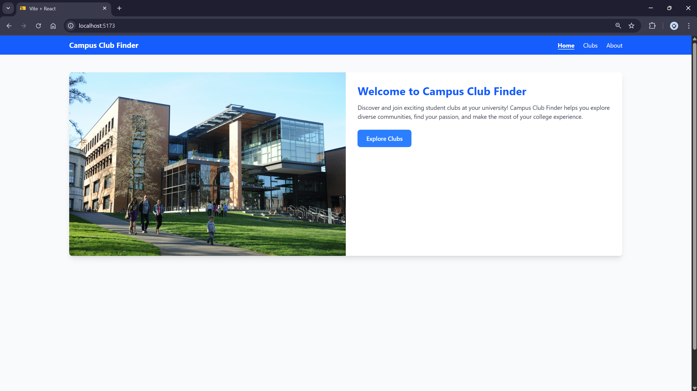
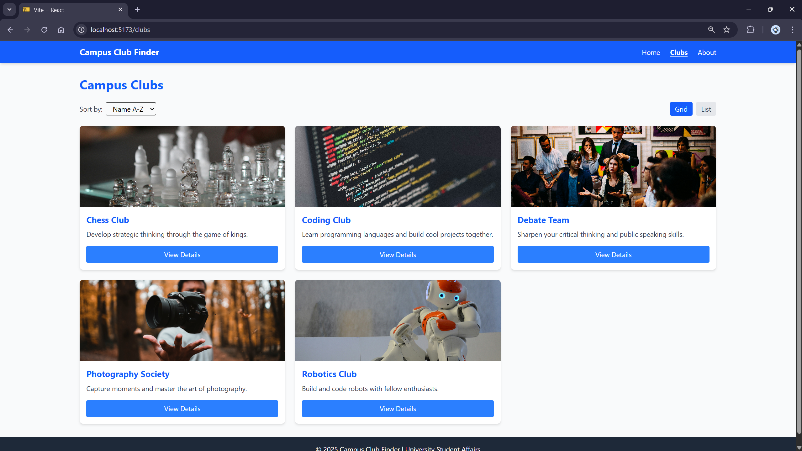
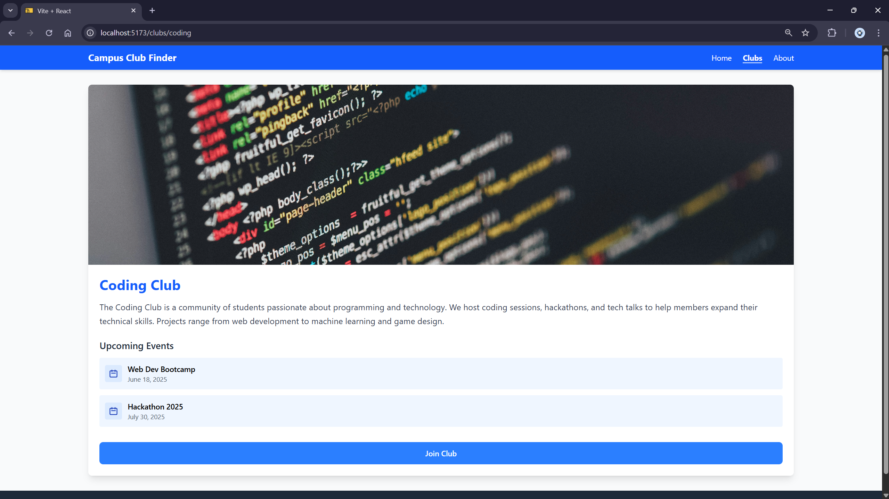
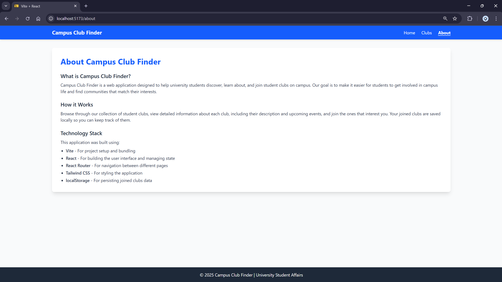
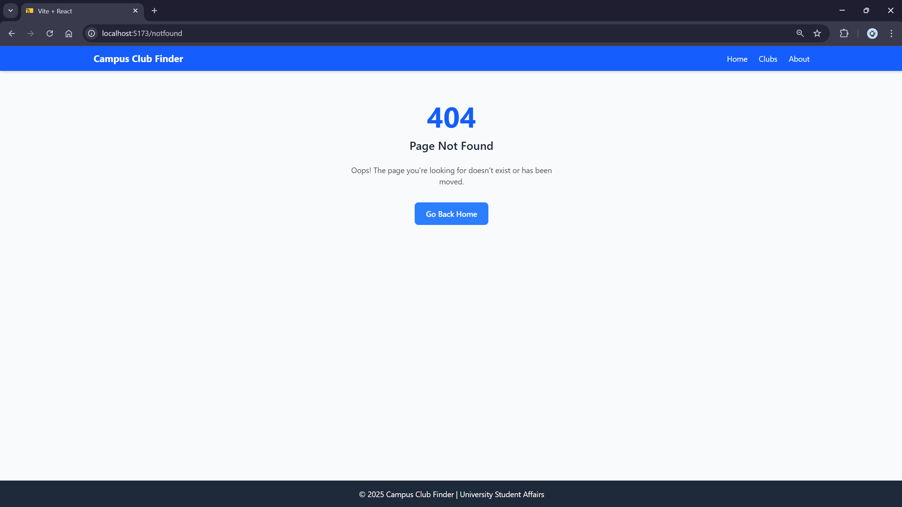

# Documentation: Campus Club Finder

## Project Walkthrough

### 1. **Initial State (Halaman Utama)**

- Saat pertama kali membuka aplikasi, pengguna akan disambut dengan **Halaman Utama**.
- Halaman ini berisi **pesan sambutan** singkat yang menjelaskan tujuan aplikasi dan tombol untuk mengakses daftar klub (tombol "Go to Clubs").
- Di bagian ini juga terdapat **hero image** yang menarik.

**Fitur pada Halaman Utama:**

- **Pesan sambutan** yang memberi tahu pengguna tentang aplikasi.
- **Tombol CTA** yang mengarahkan pengguna ke halaman daftar klub.

**Screenshot**:

---

### 2. **Halaman Daftar Klub (/clubs)**

- Di halaman ini, pengguna akan melihat daftar **5 klub mahasiswa** yang tersedia.
- Setiap klub ditampilkan dalam bentuk **kartu** yang berisi nama klub, gambar, deskripsi singkat, dan tombol "View Details".
- Pengguna dapat **menyortir** klub berdasarkan nama (A-Z atau Z-A) menggunakan dropdown atau tombol.
- Pengguna juga dapat **beralih antara tampilan grid dan list**, untuk menampilkan klub dalam bentuk grid atau dalam daftar vertikal.

**Fitur pada Halaman Daftar Klub:**

- **Sortir Klub**: Dropdown atau tombol untuk mengurutkan klub berdasarkan nama.
- **Tampilan Grid dan List**: Pengguna dapat memilih untuk melihat klub dalam tampilan grid atau tampilan daftar vertikal.
- **Informasi Klub**: Setiap klub menampilkan gambar, nama, deskripsi singkat, dan tombol untuk melihat detail lebih lanjut.

**Screenshot**:

---

### 3. **Halaman Detail Klub (/clubs/:clubId)**

- Setelah pengguna mengklik tombol "View Details" di halaman daftar klub, mereka akan diarahkan ke halaman **Detail Klub**.
- Halaman ini menunjukkan **informasi lengkap** tentang klub, termasuk nama klub, gambar besar, deskripsi lengkap, dan **daftar acara yang akan datang**.
- Pengguna dapat memilih untuk **bergabung dengan klub** dengan mengklik tombol "Join Club". Jika mereka belum bergabung, tombol akan menyimpan status ke **localStorage**, yang menandakan bahwa pengguna telah bergabung dengan klub tersebut.
- Jika pengguna sudah bergabung dengan klub, tombol "Join Club" akan menghilang atau menjadi dinonaktifkan, dan teks "You have joined this club!" akan muncul sebagai konfirmasi.

**Fitur pada Halaman Detail Klub:**

- **Informasi Klub Lengkap**: Nama, gambar besar, deskripsi, dan daftar acara mendatang.
- **Tombol Bergabung**: Pengguna dapat bergabung dengan klub dan statusnya akan disimpan di **localStorage**.
- **Konfirmasi Bergabung**: Jika sudah bergabung, tombol akan dinonaktifkan atau menghilang.

**Screenshot**:

---

### 4. **Halaman Tentang (/about)**

- Halaman ini memberikan **penjelasan singkat tentang aplikasi** dan teknologi yang digunakan untuk membangunnya.
- Pengguna dapat membaca tentang bagaimana aplikasi ini dibuat, serta tentang **Vite**, **React**, **React Router**, **Tailwind CSS**, dan **localStorage**.

**Fitur pada Halaman Tentang:**

- **Penjelasan tentang aplikasi**: Menyediakan konteks tentang fungsionalitas aplikasi.
- **Penjelasan tentang teknologi**: Informasi mengenai stack teknologi yang digunakan dalam aplikasi ini.

**Screenshot**:

---

### 5. **Halaman 404 (Tidak Ditemukan)**

- Jika pengguna mengunjungi URL yang tidak dikenal atau halaman yang tidak ada, aplikasi akan menampilkan **halaman 404** dengan pesan "Page Not Found".
- Halaman ini menyediakan tombol untuk kembali ke **Halaman Utama**.

**Fitur pada Halaman 404:**

- **Pesan Tidak Ditemukan**: Memberikan informasi kepada pengguna bahwa halaman yang diminta tidak ditemukan.
- **Tombol Kembali ke Home**: Pengguna dapat kembali ke halaman utama aplikasi.

**Screenshot**:

---

## Penyimpanan Data (localStorage)

Aplikasi ini menggunakan **localStorage** untuk menyimpan informasi tentang klub yang telah **bergabung** oleh pengguna. Jika pengguna memutuskan untuk bergabung dengan klub, status tersebut akan disimpan dalam **localStorage** sehingga tetap ada meskipun pengguna menutup aplikasi atau merefresh halaman.

- Ketika pengguna menekan tombol "Join Club" di halaman detail klub, aplikasi akan menyimpan status bergabung ke **localStorage**.
- Jika pengguna sudah bergabung, tombol tersebut akan digantikan dengan pesan yang mengatakan "You have joined this club!".

---

## Struktur Proyek

Berikut adalah struktur file proyek yang digunakan untuk aplikasi ini:

src/
├── components/ # Komponen UI yang dapat digunakan ulang
├── pages/ # Halaman untuk setiap route
├── data/ # Data klub
├── hooks/ # Custom hooks seperti useLocalStorage
└── public/images/ # Gambar-gambar klub

---

## Kesimpulan

Dokumentasi ini memberikan panduan untuk memahami **Campus Club Finder** dari awal hingga akhir. Dengan menggunakan fitur-fitur seperti penyortiran klub, tampilan grid dan list, serta kemampuan untuk bergabung dengan klub dan menyimpan data, aplikasi ini memberikan cara yang mudah bagi mahasiswa untuk terhubung dengan klub-klub yang ada di kampus mereka.
